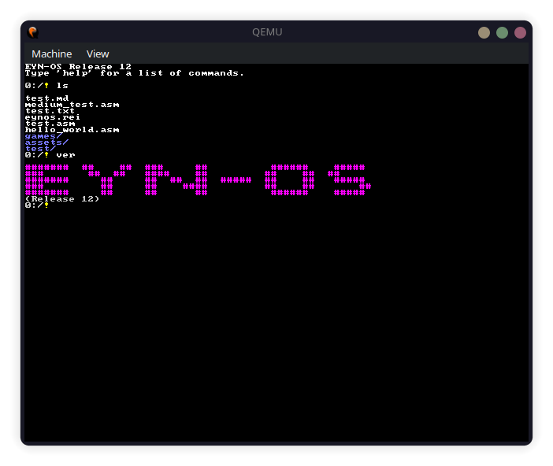

# EYN-OS - A Freestanding x86 Operating System

EYN-OS is a complete operating system built from scratch with the philosophy of "reinventing the wheel" - understanding and implementing every component of the system. It features a custom filesystem, built-in development tools, games, and a comprehensive user interface with advanced stability and portability features.

## Features

### Core System
- **Freestanding x86 Kernel**: Complete operating system without external dependencies
- **Custom EYNFS Filesystem**: Native filesystem designed for EYN-OS
- **FAT32 Support**: Compatibility with existing filesystems
- **Advanced Memory Management**: Dynamic heap sizing with corruption detection
- **Intelligent Exception Handling**: Recovery mechanisms instead of system halts

### Stability & Security
- **Exception Recovery**: Intelligent ISR handlers that attempt recovery
- **Memory Protection**: Heap corruption detection and stack overflow protection
- **Command Safety**: Input validation, argument sanitization, injection prevention
- **Process Isolation**: Memory separation between kernel and user programs
- **Error Logging**: Comprehensive error tracking and reporting system

### Portability & Performance
- **Dynamic Memory Detection**: Automatic RAM detection using multiboot info
- **Adaptive Heap Sizing**: Conservative memory allocation for low-end systems
- **Streaming Command System**: On-demand command loading to reduce memory footprint
- **Optimized File I/O**: Dynamic buffering with up to 64KB support
- **Target Systems**: 16MB RAM minimum, optimized for 128KB+ systems

### User Interface
- **Text User Interface (TUI)**: Consistent interface across all applications
- **Command History**: Navigate previous commands with arrow keys
- **Interactive Help**: Professional TUI help system with dual-pane layout
- **Text Editor**: Built-in write editor for file editing
- **File Rendering**: REI image display and Markdown formatting

### Development Tools
- **Built-in Assembler**: NASM-compatible assembler for x86 code
- **Custom Executable Format**: EYN format for user programs
- **Program Loader**: Safe execution of user programs with process isolation
- **Calculator**: Basic mathematical operations
- **Hex Dump**: Binary file inspection tool

### Games and Applications
- **Game Engine**: Framework for built-in games
- **Snake Game**: Complete implementation with TUI interface
- **Game Data Files**: Games stored as `.txt` files for easy distribution
- **Drawing Tool**: Rectangle drawing with color support

### Utilities
- **Random Number Generator**: Linear Congruential Generator
- **Sorting Algorithms**: Quicksort and bubble sort implementations
- **Search Function**: Boyer-Moore string search algorithm
- **File Operations**: Complete filesystem management
- **Memory Management**: Advanced heap management and testing tools

### Shell Commands

#### Essential Commands (Always Available)
- **System**: `init`, `exit`, `clear`, `help`
- **Filesystem**: `ls`
- **Memory Management**: `memory`, `portable`, `load`, `unload`, `status`

#### Streaming Commands (Loaded on Demand)
- **Filesystem**: `format`, `fdisk`, `fscheck`, `copy`, `move`, `del`, `cd`, `makedir`, `deldir`
- **File Operations**: `read`, `write`, `read_raw`, `read_md`, `read_image`
- **Basic Commands**: `echo`, `ver`, `calc`, `search`, `drive`, `run`
- **Advanced**: `random`, `history`, `sort`, `game`, `draw`, `spam`
- **Development**: `assemble`, `hexdump`, `log`
- **Error & Debug**: `error`, `validate`, `process`

## Quick Start

### Building EYN-OS
```bash
cd EYN-OS
make clean
make
```

### Running in QEMU
```bash
make run
```

Or manually:
```bash
qemu-system-i386 -cdrom EYNOS.iso -hda tmp/boot/disk.img -hdb tmp/boot/eynfs.img -boot d
```

### Running on Real Hardware
Flash the `EYNOS.iso` to a USB drive and boot from it. Tested on Intel x86 hardware.

### Generating Documentation
```bash
make docs  # Generates command reference documentation
```

## Example Usage

### Basic Navigation
```
0:/! ls
0:/! cd games
0:/games! ls
0:/games! game snake
```

## Contributing

EYN-OS welcomes contributions! Whether you want to add new commands, improve existing features, or fix bugs, we have resources to help you get started:

- **[Contributing Guide](CONTRIBUTING.md)**: Complete guide for new contributors
- **[Command Reference](docs/command-reference.md)**: Auto-generated documentation of all commands
- **[Development Tools](devtools/)**: Scripts and utilities for development

### Quick Contribution Tips
- Use the unified command registration system: `REGISTER_SHELL_COMMAND`
- Follow the simplified include system: `#include <header.h>`
- Test your changes with `make clean && make && make run`
- Generate updated documentation with `make docs`

### Memory Management
```
0:/! load              # Load all streaming commands
0:/! status            # Check loaded commands
0:/! memory stats      # View memory statistics
0:/! unload            # Free memory when done
```

### Development
```
0:/! write hello.asm
0:/! assemble hello.asm hello.eyn
0:/! run hello.eyn
```

### File Management
```
0:/! makedir projects
0:/! cd projects
0:/projects! write test.txt
0:/projects! read test.txt
0:/projects! copy test.txt backup.txt
0:/projects! move backup.txt /backup/
```

### File Format Support
```
0:/! read doc.md       # Smart file display
0:/! read_md doc.md    # Markdown with formatting
0:/! read_image logo.rei # REI image display
0:/! read_raw data.bin # Raw binary display
```

## System Requirements

- **Architecture**: Intel x86 (32-bit)
- **Memory**: Minimum 16MB RAM, recommended 32MB+, optimal 64MB+
- **Storage**: Any block device (hard disk, USB, etc.)
- **Display**: VGA text mode (80x25)
- **ISO Size**: 6.3MB (ultra-minimal, legacy BIOS only)

## Architecture

### Boot Process
1. **GRUB**: Multiboot 1.0 compliant bootloader
2. **Memory Detection**: Dynamic RAM detection using multiboot info
3. **Kernel**: Assembly entry point → C kernel initialization with adaptive sizing
4. **Drivers**: VGA, keyboard, ATA disk controller
5. **Filesystem**: EYNFS or FAT32 detection and mounting
6. **Shell**: Command-line interface with streaming commands ready for user input

### Memory Layout
- **0x00000000-0x000FFFFF**: Real mode and BIOS
- **0x00100000-0x001FFFFF**: Kernel code and data
- **0x00200000-0x007FFFFF**: Available memory (adaptive heap)
- **0x00800000+**: High memory (if available)

### Streaming Command Architecture
- **Essential Commands**: Always available in RAM for core functionality
- **Streaming Commands**: Loaded on-demand to conserve memory
- **Dynamic Loading**: Use `load`/`unload` to manage memory usage
- **Status Tracking**: Use `status` to see loaded commands

### Filesystem Structure
```
/
├── games/
│   └── snake.dat
├── projects/
│   ├── hello.asm
│   └── hello.eyn
└── documents/
    └── readme.txt
```

## Release 12 Highlights

### Stability Improvements
- **Intelligent Exception Handling**: System attempts recovery instead of halting
- **Memory Corruption Detection**: Advanced heap validation and error reporting
- **Command Safety**: Input validation and argument sanitization
- **Process Isolation**: Memory separation for user programs

### Portability Enhancements
- **Dynamic Memory Detection**: Automatic RAM detection using multiboot info
- **Adaptive Heap Sizing**: Conservative memory allocation for low-end systems
- **Streaming Command System**: On-demand command loading to reduce memory footprint
- **Optimized File I/O**: Dynamic buffering with efficient memory usage

### User Experience
- **Professional Help System**: Interactive TUI with dual-pane layout
- **File Format Support**: REI image rendering and Markdown formatting
- **Clean Output**: Removed debug messages for professional appearance
- **Command Consistency**: All registered commands properly included in streaming system

## Development Philosophy

### Why "Reinvent the Wheel"?
- **Learning**: Understanding how everything works
- **Control**: Full control over system behavior
- **Simplicity**: No unnecessary complexity
- **Customization**: Tailored to specific needs

### Code Style
- **Clear Comments**: Extensive documentation in code
- **Simple Functions**: One function, one purpose
- **Consistent Naming**: Descriptive function and variable names
- **Error Handling**: Graceful error recovery where possible
- **Professional Output**: Clean, informative user messages

## Documentation

Comprehensive documentation is available in the `docs/` directory:

- **[System Overview](docs/system-overview.md)**: High-level architecture and Release 12 features
- **[EYNFS Specification](docs/filesystems/eynfs.md)**: Native filesystem details
- **[Shell System](docs/ui/shell.md)**: Command-line interface with streaming architecture
- **[Quick Reference](docs/quick-reference.md)**: Command cheat sheet with Release 12 updates
- **[API Reference](docs/api/headers.md)**: Complete header documentation

## Contributing

EYN-OS is designed to be educational and extensible. When adding features:

1. **Follow the Style**: Match existing code style and patterns
2. **Document Everything**: Update relevant documentation
3. **Test Thoroughly**: Ensure features work correctly
4. **Keep it Simple**: Prefer simple, understandable implementations
5. **Consider Memory**: Optimize for low-end systems

## Future Development

### Planned Features
- **Protected Mode**: Full 32-bit protected mode with paging
- **Multitasking**: Basic process scheduling
- **Network Support**: TCP/IP stack
- **GUI System**: Graphical user interface
- **More Games**: Tetris, Pong, Space Invaders
- **File Browser**: Visual file management
- **Raycaster**: 3D graphics demo

### Extensibility
- **Module System**: Loadable kernel modules
- **Plugin Architecture**: Extensible application framework
- **API Stability**: Stable programming interfaces

## Screenshots


*The EYN-OS shell showing the help command and version information*

## License

EYN-OS is public domain software. See the UNLICENSE file for details.

---

*By Kian Gentry*
